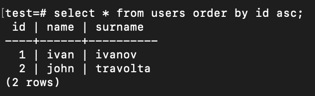
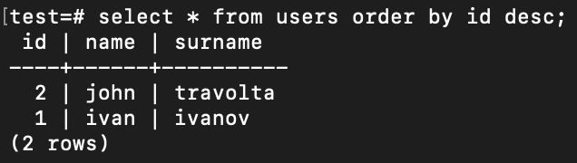

# Description

ASC-DESC относятся к сортировке в SQL запросах.

## ASC

Сортировка по возрастанию (от меньшего к большему).

Пример:

```sql
SELECT * FROM users ORDER BY id ASC;
```



## DESC

Сортировка по уменьшению (от большего к меньшему).

Пример:

```sql
SELECT * FROM users ORDER BY id DESC;
```


